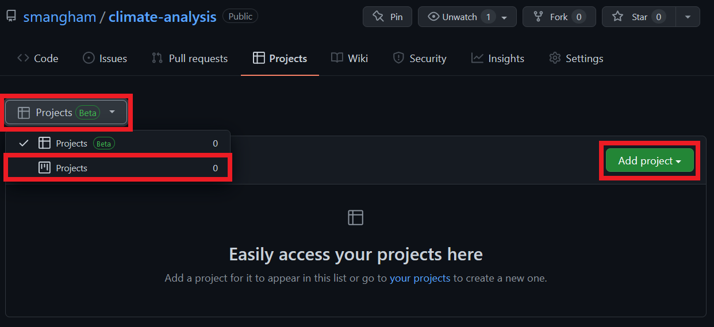
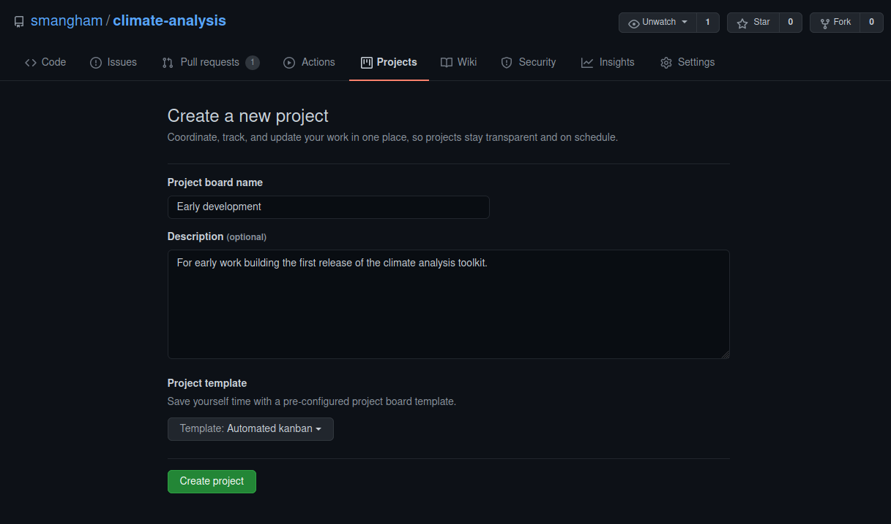
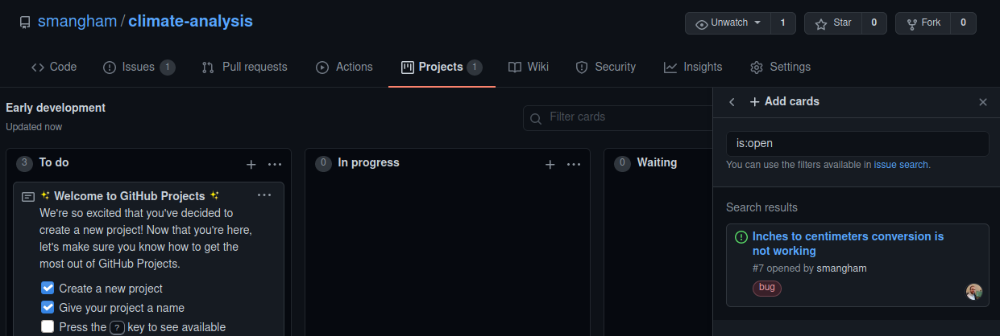
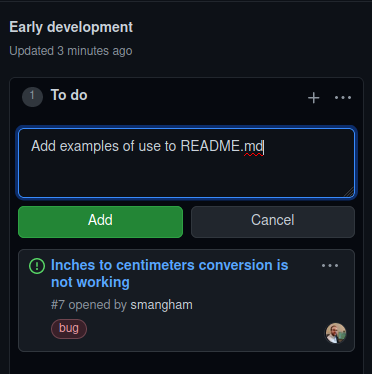

Developing academic software is a project, and most projects (software and *non*-software alike!) consist of multiple tasks. Keeping track of the list of tasks you have to do, and how far you are through each, quickly becomes a non-trivial task itself. Without a good framework, it can be hard to keep track of what's done, or what needs doing, and particularly hard to convey that to others or share the responsibilities out. 

## Project boards

A **project board** (or **kanban board**, from the japanese for a card) is a tool for keeping track of all the different components of a project, and what their current status is. They do this using **columns** and **cards**- you break your project down into tasks which you write on **cards**, then move them between **columns** that describe the status of each task. Cards are usually small, descriptive and self-contained tasks that build on each other- think "Add reader for .csv files" instead of "Get input working". Breaking a project down into clearly-defined tasks makes it a lot easier.

In industry, they often use formal project management styles for their boards with specific columns and usages, but we're going to use a simple, flexible format- not least because the more complicated your project board gets, the harder it is for you to get your collaborators to use it...

### To GitHub

There's a lot of sites that host project boards. For non-software projects like thesis-writing or organising conferences, you might use [Trello](https://trello.com), but repository hosting sites like GitHub and GitLab have built-in project boards that interact with the other features of the site, so we're going to use them (though other tools like [Jira](https://www.atlassian.com/software/jira) also offer this functionality). This episode will use GitHub as an example, but GitLab has almost identical functionality. 

From the 'Project' tab on GitHub, we can start up a board with **Create a new project**. A repository can have multiple project boards on it- for example, if multiple PhD students have their own project working on a code, each can have a project board for their own changes, or you can create a new board for each paper.

First, we need to give our project a name, e.g. "Early development". Then, we can think about the columns.

### Columns

Almost all styles of board have three 'basic' columns, with pretty self-explanatory names:
* To Do
* In Progress
* Done

GitHub provides template boards that automatically have those columns- and more, it has **automated templates**. If you add a pull request to the board, it can automatically move it to 'Done' for you when you merge it. We're going to select the **Automated kanban template**, then **Create project**.

One common extra column is **On hold** or **Waiting**. If you have tasks that get held up by waiting on other people (e.g. to provide you with data or respond to your questions) then moving them to a separate column makes their current state clearer. We're going to add a **Waiting** column, and drag it in-between In Progress and Done.

### Cards

One of the advantages of using GitHub or GitLab to host your project board is the integration with **issues**. You can easily add issues to your project board, to keep track of how they're progressing.

You can create cards on the project board, or you can **import existing issues**. Let's add the issue we created last episode to the **To Do** column- click **Add card** and drag it over.

We can also create a card without an issue. The repo currently doesn't tell people how to use the code- it needs an example. So let's clear out the default cards GitHub adds using the **...** button and create a new one in **To Do** using the **+** button.

Notes can have detailed content like checklists, but that only goes so far. Later on you might want to convert the card to an issue so you can add labels or write detailed comments. Fortunately, you can use the **Convert to issue** option you just saw in the **...** menu. It's often a good idea as you can use the comments section on the issue to write everything you tried- and, importantly, everything that *failed* for future reference.

Sometimes, a card you thought was simple and self-contained might turn out to be a bigger task than you thought. In that case, it's sensible to create new cards that reference the one they broke off from.

Our project board is looking a little thin, but for an example full one check out the plotting library [Plotly](https://github.com/orgs/plotly/projects/3).

> ## Labelling
> 
> You can see that your issue card has a 'bug' label, but the one you made has no labels. Convert your new card to an issue, and add the **Documentation** label to it.
{: .challenge}

### Prioritisation

Once your project board has a large number of cards on it, you might want to begin priorisiting them. Not all tasks are going to be equally important, and some will require others to be completed before they can even be begun. Common methods of prioritisation include:

* **Vertical position:** The vertical arrangement of cards in a column represents their importance. High-priority bugs go to the top of **To Do**, whilst tasks that depend on others go beneath them. This is the easiest one to implement, though you have to remember to correctly place cards when you add them.
* **Priority columns:** Instead of a single **To Do** column, you have two or more- a **To Do: Low Priority** and a **To Do: High Priority**. When adding a card, you pick which is the appropriate column for it. You can even add a **Triage** column for newly-added issues that you've not yet had time to classify. This format works well for project boards devoted to bugs.
* **Labels:** If you convert each card into an issue, then you can label them with their priority- GitHub lets you create new labels and set their colour. **Green low**, **orange medium** and **red high** priority labels make for a very visually clear indication, but require the most admin as each card has to be an issue to receive a label.

> ## Prioritisation
> 
> Currently, we don't really have enough cards to prioritise. Create a new card named **"High priority"**, and using one of the prioritisation schemes arrange your board so it's the most important.
{: .challenge}

> ## Advanced Schemes
> 
> Whilst you can prioritise your tasks using simple schemes, more advanced ones exist in industry. **MoSCoW** (**Must, Should, Could, Won't**) is one such scheme, which splits your tasks up into no more than 60% **must-have** features, and no less than 20% **could-have** features.
> 
> If your must-have features take longer than expected to implement, you have a pre-made list of what you can cut to complete the project on-time. If you have a relatively well-defined project that needs to be completed to a strict deadline, consider looking into MoSCoW.
{: .callout}

## Forks

'Forking' a repository is similar to creating a new branch, but on a much larger scale- you create your own copy of the **whole repository**, that is **linked back to the original**.

For some large projects, or open-source projects, it's not practical to have all the collaborators working on the same repository. Multiple different developers might both create branches with the same name, leading to conflicts, and developers can end up with access to dozens of work-in-progress branches they don't know anything about. Others limit the ability of unauthorised users to push to the repository to prevent abuse, or accidental uploads of sensitive or restricted material. In these contexts, it makes more sense for **every collaborator to have their own fork**. Then, once they finish work on a feature branch, they can **submit a pull request back to the original**.

We're going to create a fork of an existing repository- `swc-rf4`. [Go to the repository on GitHub](https://github.com/Southampton-RSG/swc-rf4), and click **Fork**. You can fork a repository to your own account, or any **Team** you have access to. For now, we'll clone a personal copy.

As you can see, the fork looks and works just like a normal repository, but handily tells you how far you are behind the original.

You may also be able to use forks to create modified versions of existing codes that better suit your needs, depending on their software license. It is good practise to submit your modifications and improvements back to the original, though.


